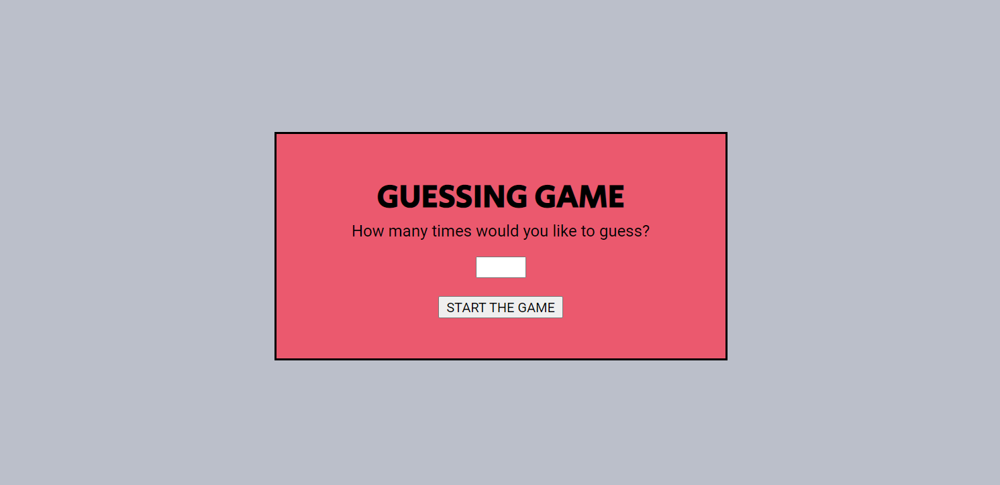

# PLAY AROUND :video_game:
In this challenge (provided by [BeCode](https://github.com/becodeorg)), I have to build three games with OOP in PHP.

## :game_die: GUESSING GAME
The player has to submit how many times he would like to guess. If not, the player will be able to guess three times by default. The player submits his guess and will get an update back: either he won, guessed too high, guessed too low or lost. The player wins when he guesses the secret number (a randomly generated number) and loses when he used all of his attempts and still didn't guess the secret number.

## :facepunch: :raised_hand: :v: Rock Paper Scissors
The classic Rock Paper Scissors game. The player has to beat the computer in 10 rounds. The score will be kept during the game. There is a custom message shown depending on the outcome.

## :spades: Blackjack
Under construction ...

## :wrench: Tools
- Visual Studio Code
- PHP
- MAMP

